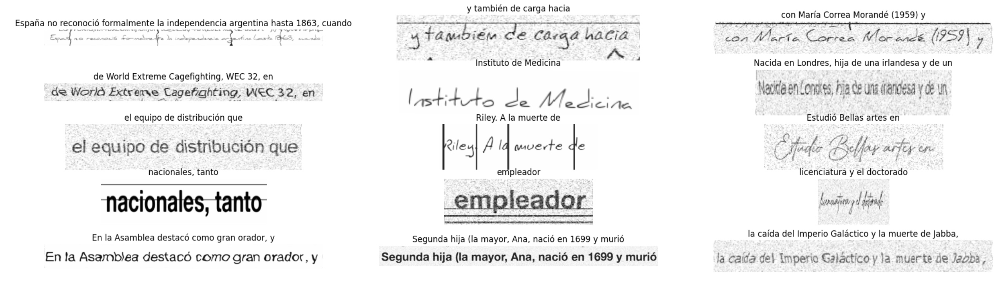

# Visually Rich Document Image Generator




A new way of generating an Optical Character Recognition (OCR) dataset on any Latin language !  
The process is simple: 

1. Launch the script to scrap a text dataset from wikipedia (based on any given language)
2. Launch the script to generate an image based on text
3. Enjoy !

## Table of Contents

- [About](#about)
- [Features](#features)
- [Installation](#installation)
- [Usage](#usage)
- [Contributing](#contributing)
- [License](#license)

## About

This project has been made publicly available by Qantev, and is the result of a research project.

## Features

This project aims to provide an easy way to create an OCR dataset (text-to-image) based on any given Latin langage. We also provide a script to scrap text from wikipedia on any language.

## Installation

In your virtual environment, just run 

```bash
pip install -r requirements.txt
```

## Usage

This repository provides two main scripts:

- Wikipedia scrapping

```bash
python extract_from_wikipedia.py \
--nb_visited_pages 10 \
--max_chunk_size 10 \
--output_path wikipedia_dataset.txt
```

These parameters respectively control the number of pages to visit (the script extracts only the second paragraph of each page), the maximum chunk size (in terms of the number of words), and the output path for the resulting text file.

- Image generation

```bash
python generate_image.py \
--text 'Hello World !' \
--font_size 24 \
--font_path '' \
--bars True \
--add_random_text True \
--add_boxes False \
--apply_data_augmentation True \
--output_path generated_image.png
```

The main parameters are `text` and `output_path` which respectively request the text to generate and the path for the resulting image. Additionally, you can choose which augmentations to apply:

- Font: You can adjust the font size and even provide a custom font (if an empty string is given, the script will randomly select a font from the `fonts` folder).
- `bars`, `random_text` and `boxes`: These options determine whether the generated image contains random horizontal or vertical bars on the text, randomly cropped text near the edges of the image, and filled-in boxes (be cautious with this option and avoid using overly long text).

- `apply_data_augmentation`: This option, as the name suggests, applies classic data augmentation methods (highly recommended).

## Contributing

Please feel free to contribute to this project and help enhance the OCR community's toolkit.

## Citation

```
@misc{lauar2024spanishtrocrleveragingtransfer,
      title={Spanish TrOCR: Leveraging Transfer Learning for Language Adaptation}, 
      author={Filipe Lauar and Valentin Laurent},
      year={2024},
      eprint={2407.06950},
      archivePrefix={arXiv},
      primaryClass={cs.AI},
      url={https://arxiv.org/abs/2407.06950}, 
}
```

## License

The license for this project is MIT.

